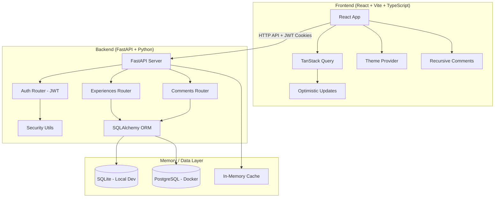
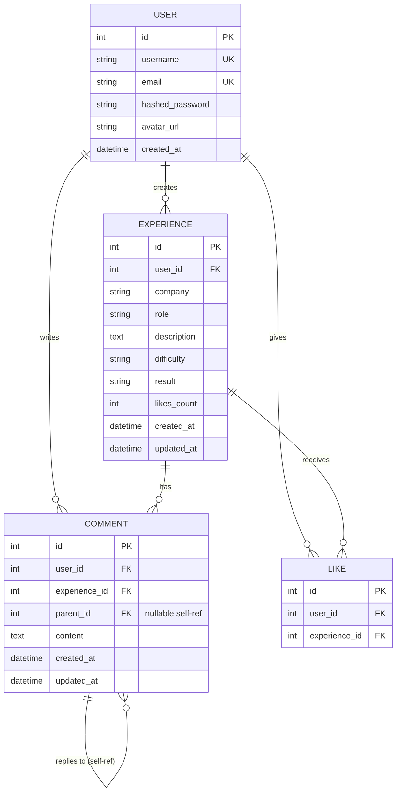

# Placement Experience Platform — Full-Stack Implementation Plan

## Overview

A full-stack **Placement Experience Platform** where university students share interview/placement experiences with Instagram-style nested comments, likes, and a polished UI. We'll build locally first, then containerize with Docker.

## Architecture



## Phase 1: Backend (FastAPI + SQLAlchemy)

### Project Structure
```
backend/
├── app/
│   ├── __init__.py
│   ├── main.py              # FastAPI app, CORS, lifespan
│   ├── config.py             # Settings via Pydantic BaseSettings
│   ├── database.py           # SQLAlchemy engine, session, Base
│   ├── models/
│   │   ├── __init__.py
│   │   ├── user.py           # User model (Argon2 hashing)
│   │   ├── experience.py     # Experience model (CRUD)
│   │   └── comment.py        # Self-referential Comment model
│   ├── schemas/
│   │   ├── __init__.py
│   │   ├── user.py           # Pydantic v2 schemas
│   │   ├── experience.py
│   │   └── comment.py
│   ├── routers/
│   │   ├── __init__.py
│   │   ├── auth.py           # Register, Login, Logout, Me
│   │   ├── experiences.py    # CRUD + cursor pagination
│   │   └── comments.py       # Nested comment CRUD
│   ├── services/
│   │   ├── __init__.py
│   │   └── cache.py          # In-memory cache layer (TTL-based)
│   └── utils/
│       ├── __init__.py
│       ├── security.py       # JWT encode/decode, password hashing
│       └── pagination.py     # Cursor-based pagination helper
├── alembic/                  # DB migrations
├── alembic.ini
├── requirements.txt
└── Dockerfile
```

### Key Backend Features

#### [NEW] Models
- **User**: `id`, `username`, `email`, `hashed_password`, `avatar_url`, `created_at`
- **Experience**: `id`, `user_id` (FK), `company`, `role`, `description`, `difficulty`, `result` (selected/rejected), `likes_count`, `created_at`, `updated_at`
- **Comment**: `id`, `user_id` (FK), `experience_id` (FK), `parent_id` (self-FK, nullable), `content`, `created_at`, `updated_at` — enables infinite nesting
- **Like**: `id`, `user_id` (FK), `experience_id` (FK) — unique constraint

#### [NEW] Auth System
- JWT tokens stored in HTTP-only secure cookies
- Password hashing with **bcrypt** (passlib)
- Protected routes via `Depends(get_current_user)`

#### [NEW] Cursor-Based Pagination
- Uses `created_at` + `id` as cursor for deterministic ordering
- Returns `next_cursor` and `has_more` in response

#### [NEW] Memory/Cache Layer
- In-memory TTL cache for hot data (experience counts, user profiles)
- Cache invalidation on writes
- Extensible to Redis for production/Docker

---

## Phase 2: Frontend (React + Vite + TypeScript + TailwindCSS)

### Project Structure
```
frontend/
├── src/
│   ├── api/
│   │   └── client.ts          # Axios instance + interceptors
│   ├── components/
│   │   ├── layout/
│   │   │   ├── Navbar.tsx
│   │   │   ├── Sidebar.tsx
│   │   │   └── Layout.tsx
│   │   ├── experience/
│   │   │   ├── ExperienceCard.tsx
│   │   │   ├── ExperienceFeed.tsx
│   │   │   ├── ExperienceDetail.tsx
│   │   │   └── CreateExperience.tsx
│   │   ├── comments/
│   │   │   ├── CommentThread.tsx    # Recursive component
│   │   │   ├── CommentItem.tsx
│   │   │   └── CommentForm.tsx
│   │   ├── auth/
│   │   │   ├── LoginModal.tsx
│   │   │   └── RegisterModal.tsx
│   │   └── ui/
│   │       ├── SkeletonLoader.tsx
│   │       ├── ThemeToggle.tsx
│   │       ├── LikeButton.tsx
│   │       └── EditedLabel.tsx
│   ├── context/
│   │   ├── AuthContext.tsx
│   │   └── ThemeContext.tsx
│   ├── hooks/
│   │   ├── useAuth.ts
│   │   ├── useExperiences.ts
│   │   └── useComments.ts
│   ├── types/
│   │   └── index.ts
│   ├── App.tsx
│   ├── main.tsx
│   └── index.css              # Tailwind + custom styles
├── package.json
├── vite.config.ts
├── tailwind.config.js
├── tsconfig.json
└── Dockerfile
```

### Key Frontend Features

- **TailwindCSS** (as specified in re.txt) for styling
- **TanStack Query** for server state with optimistic updates
- **Recursive `CommentThread`** component for infinite nesting
- **Theme Provider** with dark/light mode + smooth transitions
- **Skeleton loaders** during data fetching
- **"(edited)" labels** when `updated_at > created_at`
- **Heart animation** for likes with optimistic UI
- **Infinite scroll** feed with cursor pagination
- **React Router** for navigation

---

## Phase 3: Docker Compose

### [NEW] `docker-compose.yml`
```yaml
services:
  db:       # PostgreSQL 16
  backend:  # FastAPI (uvicorn)
  frontend: # React (nginx for production)
```

### [NEW] `backend/Dockerfile` — Python 3.12 slim
### [NEW] `frontend/Dockerfile` — Node build + Nginx serve

---

## Database ER Diagram



---

## Execution Order

| Step | What | Details |
|------|------|---------|
| 1 | Backend setup | Create FastAPI project, models, schemas, routers |
| 2 | Backend auth | JWT + bcrypt + cookie-based auth |
| 3 | Backend API | Full CRUD + nested comments + pagination + cache |
| 4 | Test backend | Run locally, verify with Swagger UI |
| 5 | Frontend setup | Create Vite + React + TS + Tailwind project |
| 6 | Frontend auth | Login/Register modals + AuthContext |
| 7 | Frontend feed | Experience cards + infinite scroll |
| 8 | Frontend comments | Recursive threaded comments |
| 9 | Frontend polish | Theme toggle, skeletons, animations |
| 10 | Test locally | Run both servers, full E2E testing |
| 11 | Docker | Dockerfiles + docker-compose.yml |

## Local Dev Strategy

- **Backend**: SQLite for local dev (zero setup), PostgreSQL for Docker
- **Frontend**: Vite dev server with proxy to FastAPI
- **Memory Layer**: Python `cachetools` TTLCache for local, extensible to Redis

## Verification Plan

### Automated Tests
- Backend: Test via FastAPI's built-in Swagger UI (`/docs`)
- Frontend: Browser testing for all interactive features

### Manual Verification
- Register → Login → Create Experience → Comment → Reply → Like flow
- Theme switching, skeleton loaders, edited labels
- Responsive design on mobile viewports
